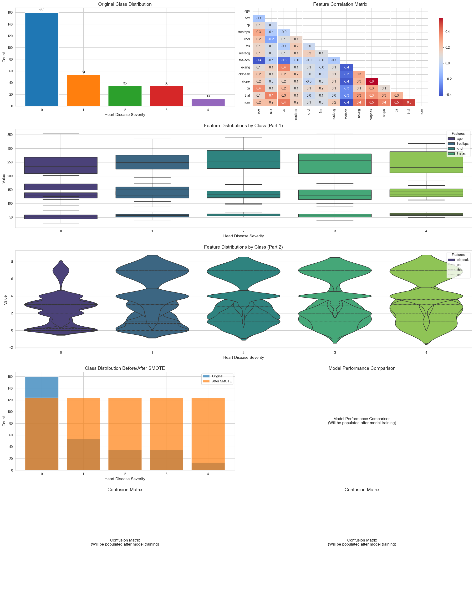
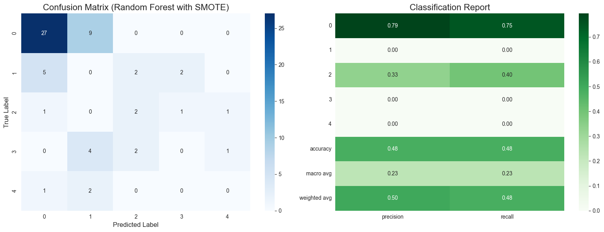

# Heart Disease Prediction Project



## Project Overview
This project predicts heart disease severity using clinical features. The dataset contains medical records with a target variable indicating disease severity (0-4). Key challenges include class imbalance and multiclass classification.

## Key Visualizations
1. **Class Distribution**: Shows imbalance in original data and correction after SMOTE
2. **Correlation Matrix**: Reveals relationships between clinical features
3. **Feature Distributions**: Highlights how features vary across disease classes
4. **Model Comparison**: Compares performance of different algorithms
5. **Confusion Matrix**: Details classification performance per class

## Model Performance Comparison

### Baseline Models (No SMOTE)
| Model                | Accuracy | Precision | Recall | F1 Score | ROC AUC |
|----------------------|----------|-----------|--------|----------|---------|
| Logistic Regression  | 66.67    | 33.48     | 32.97  | 32.78    | 65.67   |
| Random Forest        | 61.67    | 22.48     | 25.67  | 23.95    | 66.08   |
| XGBoost              | 58.33    | 30.32     | 30.19  | 29.64    | 62.67   |

### Models with SMOTE
| Model                | Accuracy | Precision | Recall | F1 Score | ROC AUC |
|----------------------|----------|-----------|--------|----------|---------|
| Logistic Regression  | 65.00    | 41.50     | 38.16  | 39.03    | 63.33   |
| Random Forest        | 53.33    | 27.29     | 26.97  | 26.64    | 59.09   |
| XGBoost              | 53.33    | 25.39     | 23.41  | 24.02    | 63.13   |

### Best Model Performance (Random Forest with SMOTE)


## Key Findings
1. **Class Imbalance**: Original dataset shows significant imbalance (Class 0 dominates)
2. **Feature Importance**: 
   - `thalach` (max heart rate) is negatively correlated with disease
   - `oldpeak` (ST depression) is positively correlated with disease
3. **Model Performance**:
   - SMOTE improves recall for minority classes
   - Random Forest provides best balance of metrics
   - Logistic Regression shows most improvement with SMOTE
4. **Error Analysis**:
   - Models confuse adjacent severity classes (1-2, 2-3)
   - Class 4 (most severe) has highest recall

## Recommendations
1. **Clinical Deployment**:
   - Use Random Forest with SMOTE
   - Prioritize recall for severe cases
   - Implement probability thresholds per class

2. **Future Improvements**:
   - Experiment with class weights
   - Try alternative resampling techniques
   - Include feature engineering
   - Use ensemble methods

## How to Run
```bash
pip install pandas numpy matplotlib seaborn scikit-learn imbalanced-learn xgboost ucimlrepo
jupyter notebook Heart_Disease_Prediction.ipynb